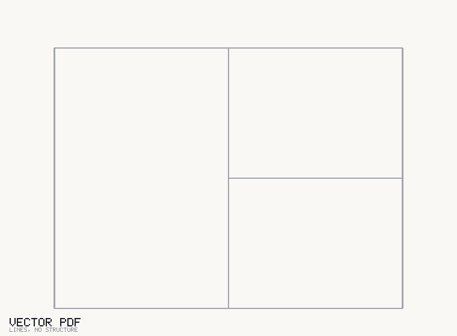

# roomgraph

**A vector floor plan PDF goes in. Rooms, areas, doors, windows and a room
adjacency graph come out.** JSON, GeoJSON and a rough IFC.



No dependencies. The PDF reader, the geometry, the IFC writer and the GIF
encoder above are all in this package, in the standard library.

```bash
python -m roomgraph.cli extract plan.pdf -o out/
```

```
plan.pdf  page 0
  scale     1:50  (dimension, confidence 0.85) - 2 dimension string(s) agreed
  walls     6
  openings  5  {'door': 3, 'window': 2}

id    name         category  gross m2  net m2  labelled  check  connects to
----  -----------  --------  --------  ------  --------  -----  -----------
R001  PHONG KHACH  living    34.56     32.35   34.60     ok     R002,R003
R002  BEP          kitchen   17.28     15.92   17.30     ok     R001
R003  PHONG NGU    bedroom   17.28     15.92   17.30     ok     R001

id    kind    symbol      width mm  conf
----  ------  ----------  --------  ----
O001  door    door_swing  1000      0.98
O002  window  window      1200      0.90
O003  window  window      1500      0.90
O004  door    door_swing  800       0.98
O005  door    door_swing  900       0.98
```

That `check` column is the drawing's own printed room area compared against the
measured one. It is the cheapest available proof that the scale was read right.

## Scope

**Clean CAD-exported PDFs.** Scans are explicitly out of scope, and that is the
whole reason this is finishable: line and symbol detection on a scan is a
research project, while a vector export already contains the lines — they just
need to be understood. Feed it a scan and it will tell you it found no walls
rather than guess.

See [docs/LIMITATIONS.md](docs/LIMITATIONS.md) for the rest of the boundary,
including the ones that will bite you.

## How it works

```
PDF content stream    walls are drawn as TWO parallel lines, and an
       |              opening is where BOTH of them stop. Everything
       v              downstream follows from that one observation.
  scale calibration   dimension strings > title block > door widths,
       |              each reported with its confidence
       v
  line clustering     segments -> the infinite lines they lie on
       |
       v
  face pairing        parallel lines 60-420mm apart -> walls + openings
       |
       v
  planar arrangement  split at crossings and T-junctions, walk half-edges
       |              -> minimal cycles = rooms
       v
  symbol library      each gap classified: door, window, cased opening
       |
       v
  room graph          shared wall = adjacent; opening on it = walkable
```

Pairing lines before pairing segments is the part that matters. Match raw
segments first and every wall broken by a doorway falls apart — and every real
plan has those.

## Install

```bash
git clone https://github.com/sophie-nguyenthuthuy/roomgraph
cd roomgraph
python -m roomgraph.cli --help
```

Python 3.10+. That is the entire installation.

## Use

```bash
# everything, into out/
python -m roomgraph.cli extract plan.pdf -o out/ -f json,geojson,ifc,svg,gif

# when you know the scale, say so -- it is exact, and detection is not
python -m roomgraph.cli extract plan.pdf --scale 1:100

# what does this PDF actually contain? layers, text, scale candidates
python -m roomgraph.cli inspect plan.pdf --text 20

# what can the library recognise?
python -m roomgraph.cli symbols

# fail the build if anything is uncertain
python -m roomgraph.cli extract plan.pdf --strict
```

As a library:

```python
from roomgraph import extract

model = extract("plan.pdf", scale="1:50")

for room in model.rooms:
    print(room.name, room.area_gross_m2, model.graph.neighbours(room.id))

print(model.graph.is_connected())     # is every room reachable?
print([e.a for e in model.graph.entrances])
for w in model.warnings:
    print("warning:", w)
```

## Outputs

| Format | What it is for |
|---|---|
| **JSON** | the canonical model — rooms, walls, openings, graph, warnings. Every other export is a projection of this. |
| **GeoJSON** | rooms as polygons, walls as lines, openings as segments. Local metres by default, or pass `--geo-origin lat,lon` for real WGS84. |
| **IFC** | IFC4 SPF: Project/Site/Building/Storey, `IfcSpace` per room, `IfcWallStandardCase` with real voids, `IfcDoor`/`IfcWindow` filling them. Rough — every height is an assumption. |
| **SVG** | the figure above, with a toggleable graph layer. Doubles as the debugging view when a room comes out wrong. |
| **GIF** | the animation at the top. Written by [`export/raster.py`](roomgraph/export/raster.py), LZW and all. |

## The symbol library is the contributor unit

**One symbol is one file** in `roomgraph/symbols/`. You add a file with a
`SYMBOL` and its `FIXTURES`; you do not touch the pipeline, the exporters, or
the tests. The suite discovers your symbol, runs your fixtures, and separately
checks that your detector does not outbid an existing symbol on that symbol's
own fixtures — so a too-greedy detector fails loudly instead of quietly stealing
openings.

Currently:

| id | scope | detects |
|---|---|---|
| `door_swing` | opening | leaf line plus a swing arc of the opening's width |
| `door_double` | opening | two half-width arcs hinged on opposite jambs |
| `door_sliding` | opening | one leaf parallel to the wall, offset, no arc |
| `window` | opening | two or more glazing lines spanning the opening |
| `window_bay` | opening | straight facets projecting out of the wall, jamb to jamb (box, canted, bow) |
| `opening_plain` | opening | a gap with nothing drawn in it |
| `stairs` | room | three or more evenly spaced treads |

Obvious gaps to fill: corner windows, folding and revolving doors, roller
shutters, curtain walling, sanitary fittings, lifts.

**[docs/SYMBOLS.md](docs/SYMBOLS.md)** has the local-frame diagram, the
context API, the confidence bands and a checklist.

## Development

```bash
python examples/make_fixtures.py            # generate the fixture PDFs
python -m unittest discover -s tests        # 142 tests
make test                                   # the same, plus a demo render
```

Fixture PDFs are generated by `examples/make_fixtures.py` rather than committed,
so their ground truth is written down next to the geometry that produces it. They
are synthetic — see the last section of
[docs/LIMITATIONS.md](docs/LIMITATIONS.md) for why that matters and what would
help most.

## Licence

MIT.
